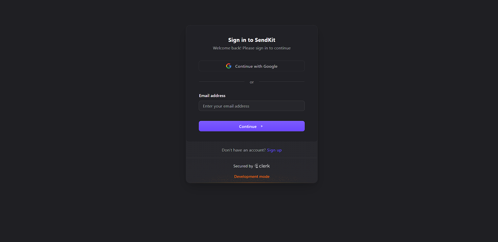
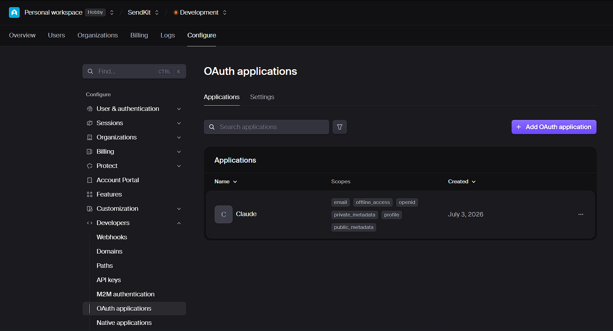

### Configurations (Initial)

* **package.json** 

    ```json
    {
        "name" : "sendkit-workspace",
        "private" : true,
        "type": "module",
        "workspaces": ["packages/*"]
    }
    ```

* **tsconfig.json** 

    ```json
    {
        "compilerOptions": {
            "target": "es2022",
            "module": "esnext",
            "moduleResolution": "bundler",
            "strict": true,
            "types": ["node"],
            "skipLibCheck": true
        }
    }
    ```

* create a **packages/cli/package.json** file with the following content:

    ```json
    {
        "name" : "sendkit",
        "version": "0.0.0",
        "private" : true,
        "type": "module"
    }
    ```

 * **run this command in the root directory**

    ```sh
    bun install
    ```

* **go to packages/cli and run these command**  

    * to create `cli`
        ```sh
        bun add commander
        ```
    * add the node types    
        ```sh
        bun add -d @types/node
        ```

### Creating a Basic CLI

* create a basic `cli` using commander : [index.ts](/packages/cli/src/index.ts)
* run this cli using command   
   
    ```sh 
    bun run dev:cli telegram <chatId> <message>
    ```

    eg : 
    ```sh 
    bun run dev:cli telegram "3123123" "hello world"
    ```

* creating **Telegram Bot**
    - go to search bar in telegram desktop
    - type `BotFather`

* create a shared package called [`core`](packages/core)  

    ```json
    {
        "name": "sendkit-core",
        "version": "0.0.0",
        "private": true,
        "type": "module",
    }
    ```

* add zod package
    ```sh
    bun add zod
    ```

---

### How to import the package developed locally (not published in npm) in a monorepo 

* open package.json of the package where you want to use the local package and add the following line in dependencies section

    ```json
    dependencies: {
    "package-name":"workspace:*"
    }
    ```

    * For example : here we are using `sendkit-core` package in `sendkit-cli` package. So we will add the following line in `sendkit-cli/package.json` file .

        [package.json](packages/cli/package.json)
        ```json
        {
            "dependencies": {
                "sendkit-core": "workspace:*"
            }
        }
        ```

* go to root directory and do 

    ```sh
    bun install
    ```

* go the `sendkit-core` package , create a `index.ts` in src folder and export every modules from it 

    ```ts
    export * from "./schemas" ; 
    export * from "./operations" ;
    ```

* then open it's `package.json` file and add 

    ```json
    {
        "exports" : {
            "." : "./src/index.ts"
        }
    }
    ```

* then import it in `sendkit-cli` package

    ```ts
    import { sendTelegramMessage } from "sendkit-core" ;
    ```

### Local MCP  
* Primarily meant to be run by the local agents (agent running on your machine) .
* It is not deployed anywhere instead it uses standard input and output transport (stdin/stdout) which can run anywhere

### Creating a Local MCP 

* package.json configration  
    ```json
    {
        "name": "sendkit-mcp",
        "version": "0.0.0",
        "private": true,
        "type": "module"
    }
    ```

* Add MCP TypeScript SDK `v1` package : [https://ts.sdk.modelcontextprotocol.io/](https://ts.sdk.modelcontextprotocol.io/)

    Git : [https://github.com/modelcontextprotocol/typescript-sdk](https://github.com/modelcontextprotocol/typescript-sdk)  

    * go inside `packages/local-mcp` and run 
        ```sh
        bun add @modelcontextprotocol/sdk zod
        ```
    
    * add `sendkit-mcp` package as dependency in `local-mcp/package.json` file

        ```json
        {
            "dependencies": {
                "sendkit-mcp": "workspace:*"
            }
        }
        ```
    
    * add node types also as dev dependency

        ```
            bun add -d @types/node
        ```

    * go to [index.ts](packages/local-mcp/src/index.ts) and create a mcp server 


        ### To grant your local agents such as `claude-cli` or `opencode`

        * create a fle name `.mcp.json` in your root directort 

            ```json
                {
                    "mcpServers" : {
                        "sendkit" : {
                            "type" : "stdio",
                            "command" : "bun",
                            "args" : ["run","dev:local-mcp"],
                            "env" : {
                                "TELEGRAM_BOT_TOKEN" : " <bot-token>"
                            }
                        }
                    }
                }
            ```


### Remote MCP
* create a lightweight hono server which is going to expose a post request to an MCP endpoint.

* instead of devloping it in a new package , we will have to make it in a new boundary called [`apps/remote-mcp`](apps/remote-mcp) cause `remote-mcp` has it's own **http boundary** , it's not a package we or the users are going to install , it is a deployable application .

* go to root `package`.json and add the following line in workspaces section

    ```json
    {
        "workspaces": ["apps/*"]
    }
    ```

* go inside `apps/remote-mcp` and create a package.json file with the following content

    ```json
    {
        "name": "sendkit-remote-mcp",
        "version": "0.0.0",
        "private": true,
        "type": "module"
    }
    ```

* install these packages inside `apps/remote-mcp` 

    ```sh
        bun add -d @types/node
    ```

    ```sh
        bun add @modelcontextprotocol/sdk 
    ```

    ```sh
        bun add hono
    ```

* add `sendkit-core` package as dependency in `remote-mcp/package.json` file

    ```json
    {
        "dependencies": {
            "sendkit-core": "workspace:*"
        }
    }
    ```

* create the remote mcp server : [index.ts](apps/remote-mcp/src/index.ts)

    ```ts
    import { Hono } from 'hono' ;
    import { 
        McpServer 
    } from '@modelcontextprotocol/sdk/server/mcp.js' ;
    import { 
        WebStandardStreamableHTTPServerTransport 
    } from '@modelcontextprotocol/sdk/server/webStandardStreamableHttp.js'
    import { sendTelegramMessage , telegramMessageInputSchema } from 'sendkit-core';

    function createServer(botToken : string){
        const server = new McpServer({
            name : "sendkit-remote",
            version : "0.0.0"
        })

        server.registerTool(
            "telegram",  // tool name
            {
                title : "Telegram",
                description : "Send a Telegram message.",
                inputSchema : telegramMessageInputSchema
            },
            async(input) =>{
                const result = await sendTelegramMessage({
                    ...input,
                    botToken, 
                })

                return {
                    // format of data agent responses to user
                    content : [
                        {
                            type : "text",
                            text : `Send Telegram message ${result.messageId} to chat ${result.chatId}`
                        }
                    ],
                    structuredContent : result
                } ;
            }
        )
        return server ;
    }

    const app = new Hono() ; // creating a Hono application

    app.post("/:botToken/mcp",async(c) =>{
        const botToken = c.req.param("botToken") ; 
        const server = createServer(botToken) ;

        const transport = new WebStandardStreamableHTTPServerTransport({
            sessionIdGenerator : undefined ,
            enableJsonResponse : true 
        })

        await server.connect(transport) ;

        try{
            return await transport.handleRequest(c.req.raw) ;
        }
        finally{
            await server.close() ;
        }
    }); 

    app.notFound((c) =>{
        return c.json({error : "Not Found"},404) ;
    }) 

    const port = Number(process.env.PORT ?? 3000) ;

    export default {
        port , 
        fetch : app.fetch
    }
    ```


* add exports in the `package.json` file  

    ```json 
        {
            "exports" : {
            "." : "./src/index.ts"
            }
        }
    ```

* Run the remote mcp server using command 

    ```sh
    bun run dev:remote-mcp
    ```

    * open command prompt and run the following command to test the remote mcp server

        ```sh
        curl -i -X POST "http://localhost:3000/not-a-real-token/mcp"
        ```

---

### Testing the Remote MCP Server (by punching holes with `Ngrok`)

* run 

    ```
    ngrok http 3000
    ```
    > 3000 is the port where the remote mcp server is running

* you will get a url like this `https://<random-string>.ngrok-free.app` which is publicly accessible and can be used to test the remote mcp server

* go to `claude.com` , go to customize then connector and create a new connector

* give it a name and for url give the ngrok url with `/<your-bot-token>/mcp` endpoint

    ```
    https://<random-string>.ngrok-free.app/<your-bot-token>/mcp
    ```

* for `chatgpt.com` , go to your profile then setting then go to app and create a new app , give the endpoint and select no authentication and save it


### Adding Auth (using `Clerk`) :
* [https://cwa.run/clerk](https://cwa.run/clerk)

* Express Intergration : [https://clerk.com/docs/expressjs/getting-started/quickstart](https://clerk.com/docs/expressjs/getting-started/quickstart)

* install packages inside `apps/remote-mcp`
    ```
    bun install @clerk/backend @clerk/mcp-tools
    ```

* MCP rules for Authorization : [https://modelcontextprotocol.io/docs/tutorials/security/authorization](https://modelcontextprotocol.io/docs/tutorials/security/authorization)

* add auth in [`index.ts`](apps/remote-mcp/src/index.ts)

* in clerk dashboard -> go to developers ->  OAuth applications -> enable Dynamic client registration ( allows OAuth Client to register themselves dynamically that mean we don't have to add custom OAuth Application for each http server such as cluade or ChatGpt instead it can register itself)

* then run the `remote mcp server` and `ngrok`

    ```sh
     bun run dev:remote-mcp
     ```

     ```sh
     ngrok http 3000
     ```

* go to claude.com and create a `SendKit` connector with same configrations as before and no need to seprately add OAuth , when you connect , you will be redirected to clerk OAuth page and you will see claude added in OAuth Applications page .

* **Clerk OAuth page**
  


*  **OAuth Applications**  
  

* same for ChatGpt , but when you do click connect and  then click signin with SendKit , you will be redirected to ChatGPT again .

    * you will need to go to `OAuth Applications` page in clerk and delete ChatGPT and create a custom OaAuth Client for it instead of dynamic